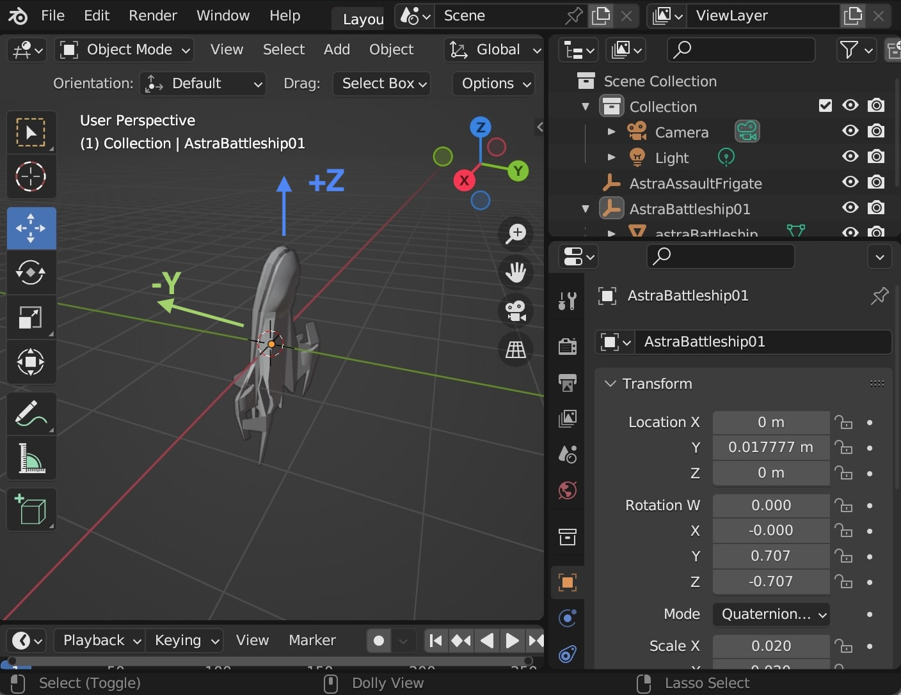
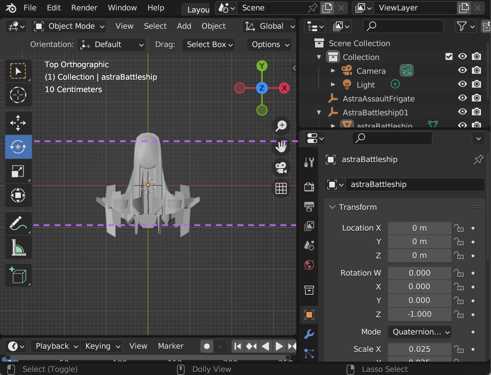

# Ships

## Formatting Ship Models

For ships to be oriented and scaled correctly, make sure the model has the
correct rotation and scale when you export it:

- Rotated with the front facing +Z and the top facing -Y

- Scaled so the ship is roughly 1 meter long.

Ships will automatically be scaled up or down based on the configuration of the
ship itself, not the size of the model. Having all ship models be 1 meter long
means the scaling is consistent across models.
