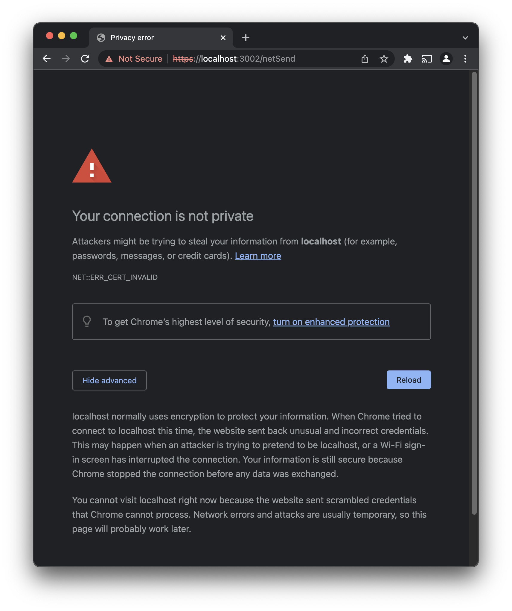

# Using HTTPS

Thorium Nova has clients connect using HTTP by default. However, browsers like
Chrome only allow certain features to be used when the connection is using
HTTPS. These include things like WebUSB, WebMIDI, WebRTC, and video and audio
capture.

None of these features are currently being used, but eventually we hope to
incorporate them into the controls. These might be used for things like:

- Connecting DMX lights and controlling them from any connected client.
- Using a MIDI control board as an interface for the controls.
- Peer-to-peer voice chat for conversations between remote crew members and
  between the crew and flight director.

## Activating HTTPS

Since Thorium Nova is hosted within the networks of players and not on the open
internet, it isn't possible to avoid the security warnings of browsers. However,
it is possible to get around them.

You can activate HTTPS by clicking the "Use HTTPS" button on the Thorium Nova
main screen. This will redirect your browser to the same page, but using the
HTTPS protocol and with the port number incremented by one, which by default
is 4445. For example, the new URL will be `https://<ip address>:4445`.

The first time you do this, you will likely see a warning from the browser about
the security of the connection. Different browsers provide different ways to
ignore this warning.

In Google Chrome, you need to click on the page and type `thisisunsafe` into the
window. There isn't a text box to type it into, you just type it on the window.
This will cause the page to actually load.

## A Note About Security

If a web browser is giving you a security warning, that means the website does
have some kind of security vulnerability. Using HTTPS with Thorium Nova is
**not** an exception.

Of course, Thorium Nova isn't designed to pose a risk to you or your computer.
While it is possible Thorium Nova could use it's HTTPS connection to do
nefarious things, if you trust the developers of Thorium Nova and the code, you
can be reasonably confident that using HTTPS with Thorium Nova is safe. Since
it's open-source, you are always welcome to review the code yourself.

If you can't bring yourself to trust Thorium Nova, than it's probably best to
not use it with the built-in HTTPS. There are ways you can set up Thorium Nova
to work with HTTPS in a secure way. You could create your own security
certificate to use with Thorium Nova or you could connect to the Thorium Nova
HTTP server using a proxy.
