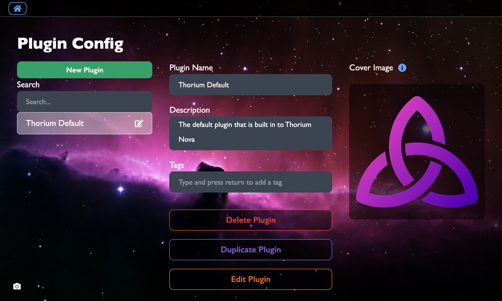
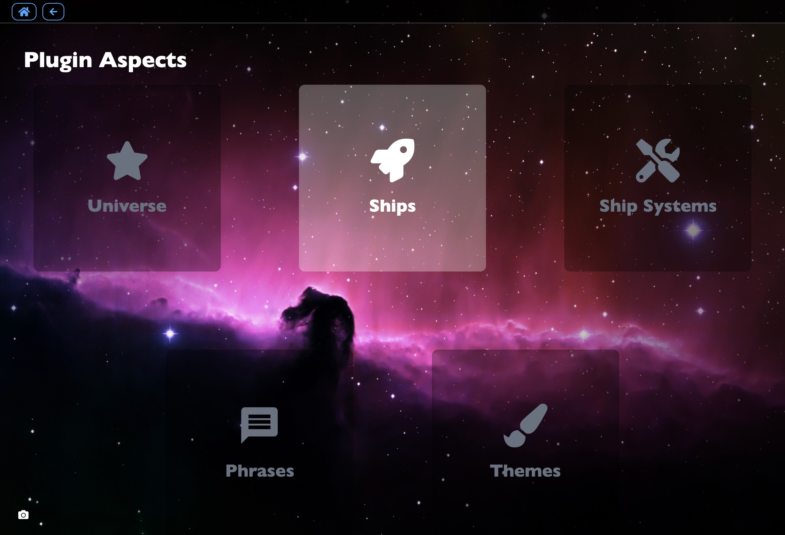

# Plugins

## What are Plugins?

Plugins are wrappers around all the things that can be configured in Thorium
Nova, and all of these things can be edited from within Thorium Nova. These
include:

- Custom themes for the controls
- UI sound packs that play when clicking on buttons and using the controls
- Ships which fly around the 3D Starmap
- Ship systems, like engines or weapons, which are a part of these ships
- Inventory on the ship, like probe casings, coolant, and repair supplies
- Planetary systems, stars, and planets in the Starmap
- Factions, or organizations which control the planets and solar systems and
  define the behavior of ships.
- Campaigns, Mission storylines, and timelines, including any visuals and
  content used during the missions

This also includes all of the assets and files which are used by these plugins,
such as images, 3D models, and sounds.

## Plugin Config

Plugins can easily be created from within Thorium Nova. On the
[Plugin Config page](/config), click "New Plugin" and enter a name. From there
you can add a description, tags, and a cover image. These last two items won't
really be useful until the Thorium Plugin Registry is available, which lets
users share the plugins that they've created.



The actual content of the plugin is handled by "Plugin Aspects", which are the
different pieces that can be configured. You can see the aspects that can be
configured by clicking the edit icon next to the plugin in the list, or by
clicking the "Edit Plugin" button.



Currently, only the "Ships" aspect is available, since it's the only one that
has been developed. You can learn more about editing aspects on the
[Ship Aspect page](/docs/plugins/ships)

## Editing Outside Thorium Nova

It is possible to edit plugins outside Thorium Nova using the file system and a
text editor.

Plugins are stored in the Thorium data folder (usually in the user's documents
folder, or in the `/server/data` folder during development) inside a folder
named `plugins`. Each plugin is its own folder, where the name of the folder is
the name of the plugin.

At a minimum, plugins need a `manifest.yml` file which contains the data for the
plugin. Here's a sample manifest:

```yml
name: Thorium Default
author: "Thorium Nova Contributors"
description: "The default plugin which is provided with Thorium Nova."
tags: []
coverImage: coverImage.svg
```

### Assets

For all plugins and their aspects, assets can be stored using either relative or
absolute paths. Relative paths are relative to the `./assets/` folder in the
same folder as the manifest file. Absolute paths are relative to the Thorium
data folder. Asset paths can also be urls starting with `http://` or `https://`.

For the plugin above, the `coverImage.svg` file is stored at
`/plugins/Thorium Default/assets/coverImage.svg`.

### Aspects

Plugin aspects are stored in folders inside the plugin folder, one for each
aspect. As of right now, there is only the Ships aspect, stored in the
`./ships/` folder. Check the [Ship Aspect page](/docs/plugins/ships) for more
information on configuring this aspect.
