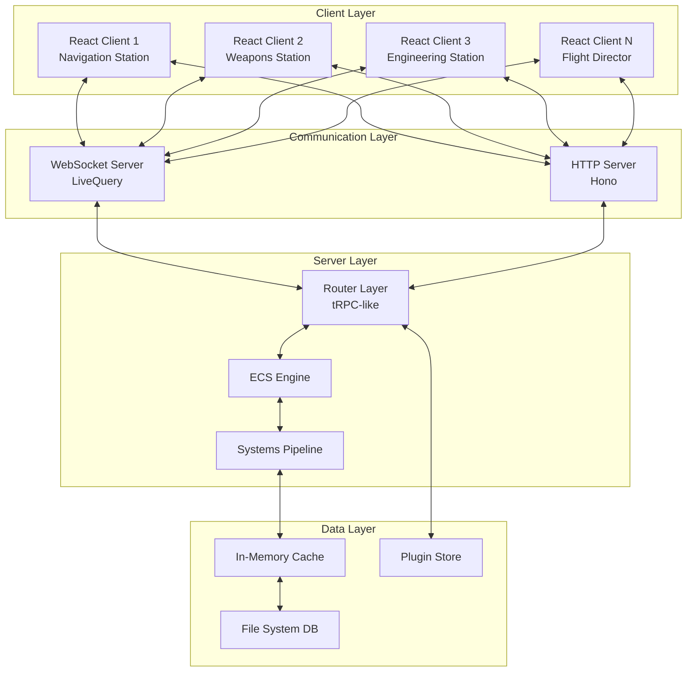
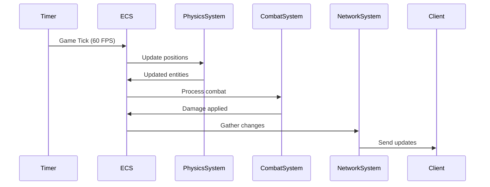
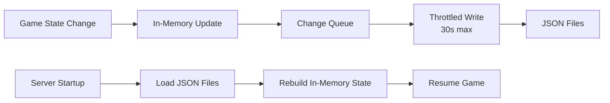
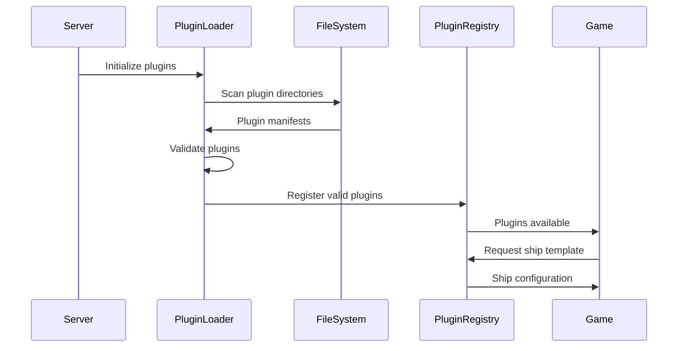
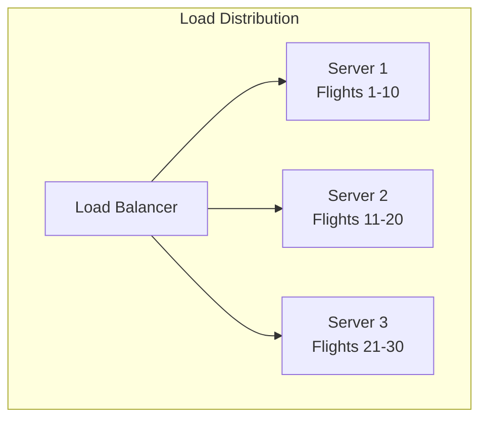

# Thorium Nova Architecture Guide

## Table of Contents
1. [System Overview](#system-overview)
2. [Core Architecture Patterns](#core-architecture-patterns)
3. [Server Architecture](#server-architecture)
4. [Client Architecture](#client-architecture)
5. [Communication Layer](#communication-layer)
6. [Data Persistence](#data-persistence)
7. [Plugin System](#plugin-system)
8. [Performance Considerations](#performance-considerations)

## System Overview

Thorium Nova is a multiplayer spaceship bridge simulator built on modern web technologies. The architecture is designed to support real-time collaboration between multiple crew members controlling different aspects of a single spaceship.



### Key Design Principles

1. **Entity Component System (ECS)**: Core game state management using composition over inheritance
2. **Real-time Synchronization**: WebSocket-based state synchronization with intelligent filtering
3. **Plugin Architecture**: Extensible system for content and functionality
4. **Type Safety**: Full TypeScript implementation with shared types between client and server
5. **Performance First**: Optimized for real-time gameplay with multiple concurrent users

## Core Architecture Patterns

### Entity Component System (ECS)

The ECS pattern is the foundation of Thorium Nova's game engine. It provides:

- **Entities**: Unique identifiers representing game objects
- **Components**: Data containers that define entity properties
- **Systems**: Logic processors that operate on entities with specific components

```typescript
// Entity Example
const shipEntity = {
  id: 12345,
  components: {
    identity: { name: "USS Voyager", description: "Intrepid-class starship" },
    position: { x: 1000, y: 0, z: 500, parentId: solarSystemId },
    velocity: { x: 0, y: 0, z: 10 },
    isShip: { registry: "NCC-74656", shipClass: "Intrepid" },
    hull: { current: 1000, max: 1000 }
  }
}

// System Example
class VelocityPositionSystem extends System {
  test(entity: Entity) {
    return !!(entity.components.velocity && entity.components.position);
  }
  
  update(entity: Entity, deltaTime: number) {
    const { velocity, position } = entity.components;
    position.x += velocity.x * deltaTime;
    position.y += velocity.y * deltaTime;
    position.z += velocity.z * deltaTime;
  }
}
```

### Plugin Architecture

Plugins provide content and configuration in a modular, reusable format:

```yaml
# Example Plugin Structure
apiVersion: ships/v1
kind: ship
metadata:
  name: Galaxy Class
  author: Thorium Team
spec:
  shipClass: Galaxy
  mass: 4500000
  volume: 5820983
  systems:
    - type: warpEngines
      maxSpeed: 9.975
    - type: phasers
      count: 12
  assets:
    model: assets/galaxy.gltf
    texture: assets/galaxy_diffuse.png
```

### Router Pattern

The router pattern provides a type-safe RPC-like interface between client and server:

```typescript
// Server-side procedure definition
export const navigation = t.router({
  setDestination: t.procedure
    .input(z.object({
      shipId: z.number(),
      destination: z.object({ x: z.number(), y: z.number(), z: z.number() })
    }))
    .send(({ ctx, input }) => {
      const ship = ctx.flight.ecs.getEntityById(input.shipId);
      ship.updateComponent("autopilot", { 
        destination: input.destination,
        enabled: true 
      });
      pubsub.publish.navigation.status({ shipId: input.shipId });
    })
});

// Client-side usage
const result = await q.navigation.setDestination.netSend({
  shipId: 123,
  destination: { x: 1000, y: 0, z: 500 }
});
```

## Server Architecture

### Bun Runtime

The server runs on Bun, providing:
- Fast startup times
- Native TypeScript support
- Built-in SQLite (though we use file system DB)
- Excellent performance for I/O operations

### Server Components

```
/app/.server/
├── init/                 # Initialization modules
│   ├── buildDatabase.ts  # Database setup
│   ├── liveQuery.ts      # WebSocket handler
│   ├── router.ts         # Route definitions
│   └── pubsub.ts         # Pub/sub system
├── systems/              # ECS Systems
│   ├── PhysicsSystem.ts
│   ├── WeaponsSystem.ts
│   └── index.ts          # System registry
├── spawners/             # Entity factories
├── data/                 # Router procedures
└── classes/              # Core classes
```

### System Execution Pipeline

Systems execute in a specific order each game tick:



## Client Architecture

### React + React Router

The client uses:
- React 19 for UI components
- React Router for navigation
- React Query for data fetching
- React Three Fiber for 3D graphics

### Component Structure

```
/app/
├── cards/               # Station UI screens
│   ├── Navigation/
│   ├── Weapons/
│   └── Engineering/
├── components/          # Reusable UI components
├── context/             # React contexts
├── hooks/               # Custom React hooks
└── routes/              # Page components
```

### Card System

Cards are modular UI components that make up station interfaces:

```typescript
// Card Definition
export const NavigationCard: Card = {
  name: "Navigation",
  category: "Helm",
  component: NavigationComponent,
  requiredSystems: ["impulseEngines", "warpEngines", "sensors"],
  dataStreams: ["position", "velocity", "nearbyObjects"]
};

// Card Component
function NavigationComponent({ shipId }: CardProps) {
  const [position] = q.navigation.position.useNetRequest({ shipId });
  const [nearbyObjects] = q.navigation.nearbyObjects.useDataStream({ shipId });
  
  return (
    <div className="navigation-card">
      <StarMap position={position} objects={nearbyObjects} />
      <EngineControls shipId={shipId} />
    </div>
  );
}
```

## Communication Layer

### LiveQuery WebSocket Protocol

LiveQuery provides real-time bidirectional communication:

```typescript
// Connection Flow
Client connects → WebSocket handshake → Client ID assigned
↓
Client subscribes to data → Server tracks subscriptions
↓
Server state changes → Relevant clients notified → UI updates

// Subscription Example
{
  type: "subscribe",
  procedure: "navigation.position",
  params: { shipId: 123 },
  requestId: "req_456"
}

// Update Example
{
  type: "update",
  requestId: "req_456",
  data: { x: 1000, y: 0, z: 500 }
}
```

### NetRequest/NetSend Pattern

Two primary communication patterns:

1. **NetRequest**: Subscribe to data with automatic updates
2. **NetSend**: Send commands/mutations to the server

```typescript
// NetRequest - Subscribes to position updates
const [position] = q.navigation.position.useNetRequest({ shipId });

// NetSend - Sends a command
await q.navigation.setSpeed.netSend({ shipId, speed: 0.5 });
```

## Data Persistence

### File System Database

Data is stored as JSON files organized by type:

```
/data/
├── flights/
│   ├── flight_123/
│   │   ├── metadata.json
│   │   ├── entities.json
│   │   └── components/
├── plugins/
│   ├── thorium-default/
│   └── custom-plugin/
└── server/
    └── config.json
```

### Persistence Strategy



## Plugin System

### Plugin Loading Pipeline



### Plugin Types

1. **Ships**: Vessel configurations and systems
2. **Systems**: Ship system definitions (weapons, engines, etc.)
3. **Themes**: UI customization
4. **Timelines**: Mission and story content
5. **Solar Systems**: Universe content
6. **Inventory**: Items and equipment

## Performance Considerations

### Optimization Strategies

1. **ECS Cache Optimization**
   ```typescript
   // Component caches for fast queries
   componentCache: Map<ComponentType, Set<Entity>>
   
   // System-specific entity lists
   systemCache: Map<System, Entity[]>
   ```

2. **Network Optimization**
   - Delta compression for position updates
   - Subscription filtering to reduce unnecessary updates
   - Batched updates within animation frames

3. **Render Optimization**
   - React.memo for expensive components
   - Virtual scrolling for large lists
   - Three.js instancing for multiple objects

### Scalability Considerations

- **Horizontal**: Multiple flights on different servers
- **Vertical**: Single flight handling more entities/systems
- **Client**: Graceful degradation for slower devices



## Best Practices

### Code Organization

1. **Colocation**: Keep related code together
   ```
   /app/cards/Navigation/
   ├── index.tsx           # Component
   ├── data.server.ts      # Server procedures
   ├── NavigationMap.tsx   # Sub-components
   └── styles.css          # Styles
   ```

2. **Type Safety**: Leverage TypeScript throughout
   ```typescript
   // Shared types between client and server
   export interface ShipPosition {
     x: number;
     y: number;
     z: number;
     parentId: number;
     timestamp: number;
   }
   ```

3. **Component Composition**: Build complex UIs from simple parts
   ```typescript
   <Panel title="Navigation">
     <StarMap />
     <ControlPanel>
       <SpeedControl />
       <HeadingControl />
     </ControlPanel>
   </Panel>
   ```

### Performance Guidelines

1. **Minimize Re-renders**: Use React.memo and useMemo appropriately
2. **Batch Updates**: Group related state changes
3. **Lazy Loading**: Code-split large components
4. **Efficient Queries**: Use ECS component caches

### Security Considerations

1. **Input Validation**: All inputs validated with Zod schemas
2. **Authorization**: Permission checks in router procedures
3. **Rate Limiting**: Prevent spam/DOS attacks
4. **Sanitization**: Clean user-generated content

## Conclusion

Thorium Nova's architecture is designed for:
- **Modularity**: Easy to extend and modify
- **Performance**: Real-time gameplay with multiple users
- **Type Safety**: Catch errors at compile time
- **Developer Experience**: Clear patterns and good tooling

The combination of ECS for game state, React for UI, and a robust communication layer creates a flexible platform for bridge simulation gameplay.