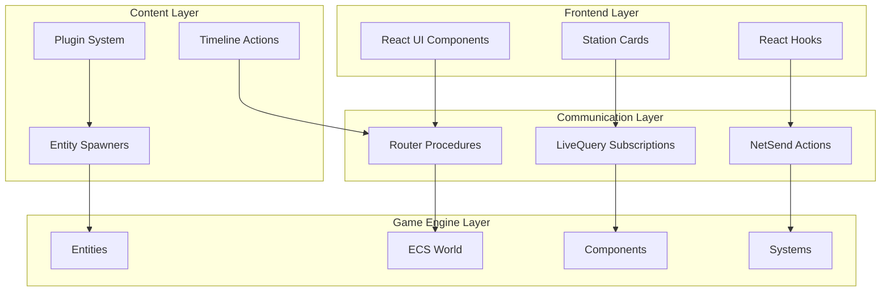
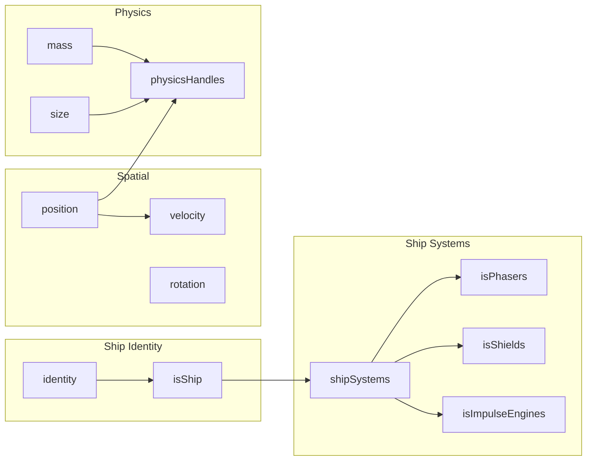
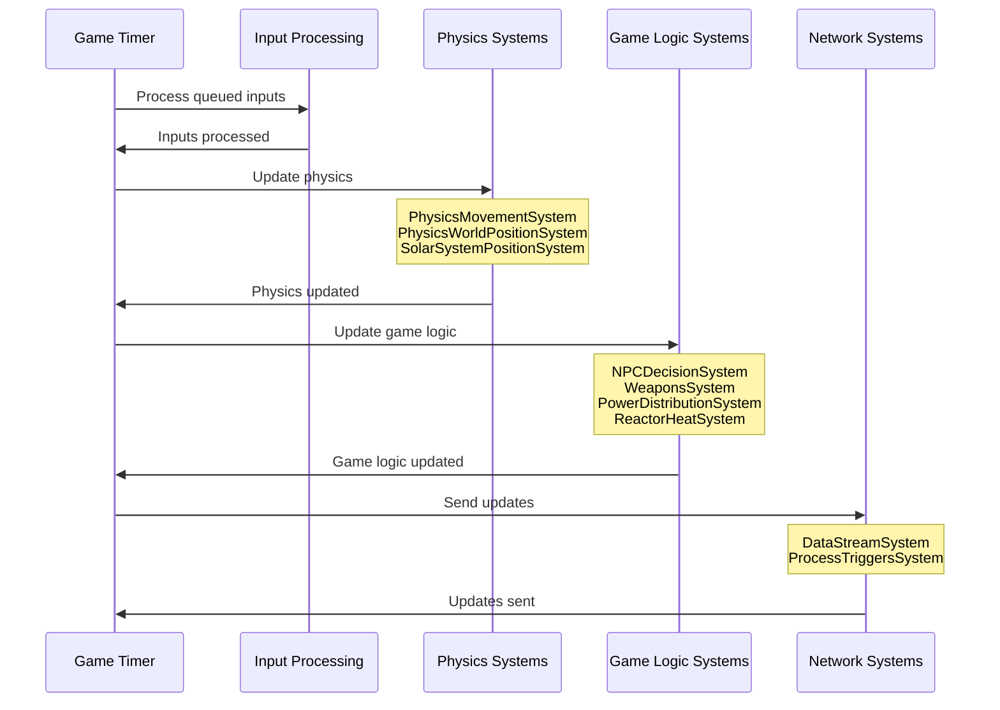
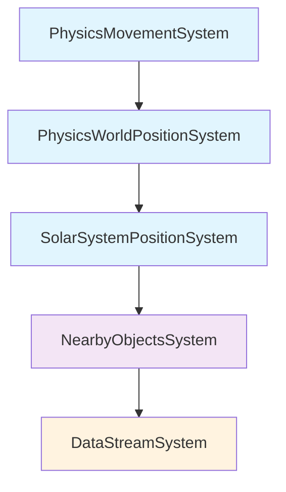
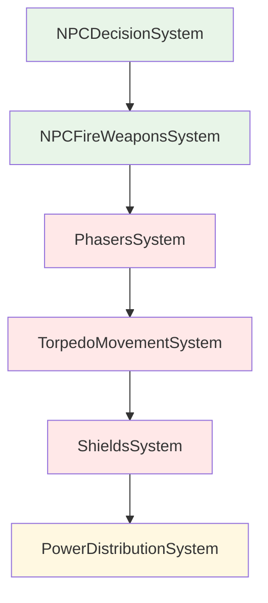
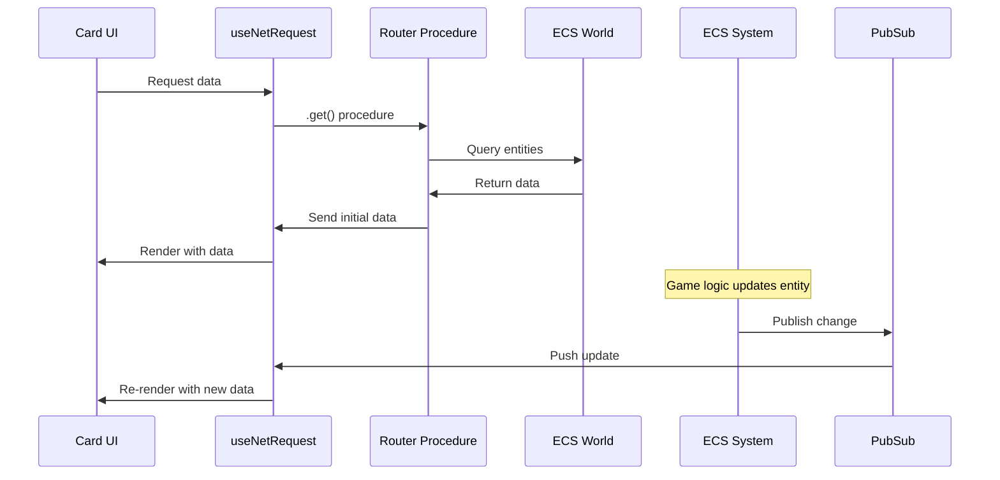
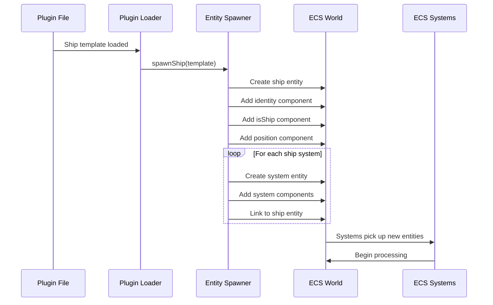
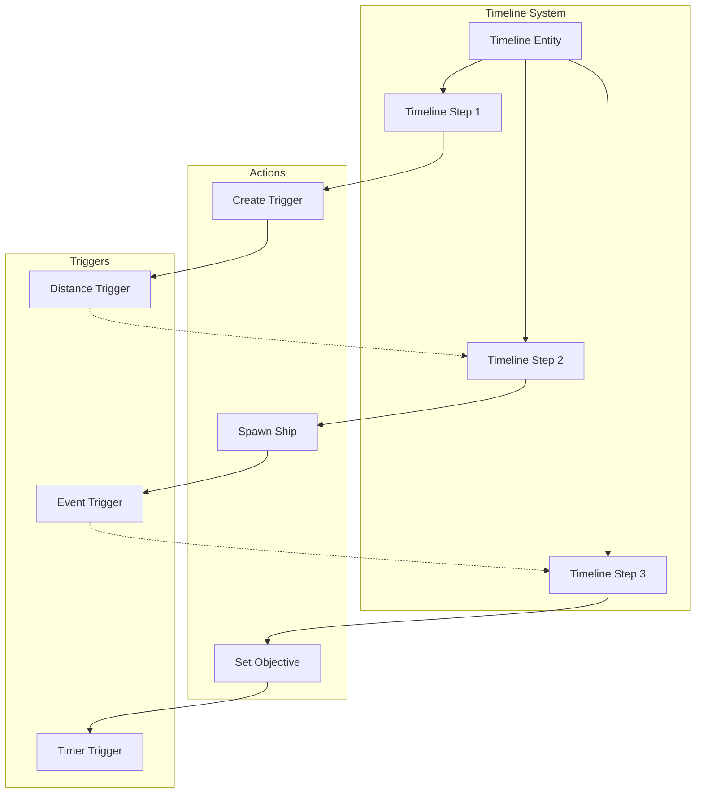

# Component Interaction Guide

## Table of Contents
1. [Overview](#overview)
2. [ECS Component Relationships](#ecs-component-relationships)
3. [System Interactions](#system-interactions)
4. [Card-System Integration](#card-system-integration)
5. [Plugin Component Integration](#plugin-component-integration)
6. [Timeline and Action Flow](#timeline-and-action-flow)
7. [Common Interaction Patterns](#common-interaction-patterns)
8. [Debugging Component Interactions](#debugging-component-interactions)

## Overview

Thorium Nova's architecture is built on interconnected components that work together to create a cohesive spaceship simulation. Understanding these interactions is crucial for development and troubleshooting.



## ECS Component Relationships

### Component Dependencies

Components often depend on other components to function properly:



### Component Composition Patterns

#### Basic Ship Entity
```typescript
// Minimal ship entity components
const basicShip = {
  identity: { name: "USS Enterprise", description: "Constitution-class starship" },
  isShip: { registry: "NCC-1701", shipClass: "Constitution" },
  position: { x: 0, y: 0, z: 0, parentId: solarSystemId },
  velocity: { x: 0, y: 0, z: 0 },
  rotation: { x: 0, y: 0, z: 0, w: 1 },
  mass: { value: 190000 }, // metric tons
  size: { length: 289, width: 127, height: 73 } // meters
};
```

#### Combat Ship Entity
```typescript
// Combat-capable ship (extends basic ship)
const combatShip = {
  ...basicShip,
  hull: { current: 1000, max: 1000 },
  shields: { status: "down", strength: 0, maxStrength: 100 },
  shipSystems: { 
    systems: [phaserSystemId, shieldSystemId, engineSystemId] 
  },
  shipBehavior: { 
    objective: "patrol", 
    patrolRadius: 10000,
    actionTarget: null 
  },
  npcKnowledge: { 
    threats: new Map(),
    activeRange: 50000 
  }
};
```

#### System Entity Components
```typescript
// Phaser system entity
const phaserSystem = {
  identity: { name: "Type-X Phaser Array", description: "Primary weapons" },
  isShipSystem: { shipId: shipEntityId, systemType: "phasers" },
  isPhasers: { 
    charge: 100,
    maxCharge: 100,
    chargeRate: 10,
    firing: false 
  },
  power: { 
    currentPower: 100,
    requiredPower: 80,
    maxSafePower: 120 
  },
  heat: { 
    heat: 0,
    maxHeat: 100,
    heatRate: 5,
    cooldownRate: 2 
  }
};
```

## System Interactions

### System Execution Order

Systems execute in a specific order each game tick to ensure consistency:



### System Dependencies

#### Physics Pipeline


#### Combat Systems Pipeline


### System Communication Patterns

#### Event-Driven Updates
```typescript
// System A modifies entity
class WeaponsSystem extends System {
  update(entity: Entity) {
    entity.updateComponent("isPhasers", { charge: newCharge });
    
    // Triggers pubsub notification
    pubsub.publish.weapons.phasers({ 
      shipId: entity.components.isShipSystem.shipId,
      systemId: entity.id 
    });
  }
}

// System B reacts to changes
class PowerDistributionSystem extends System {
  update(entity: Entity) {
    // Reacts to phaser charge changes through component queries
    const phaserSystems = this.getEntitiesWithComponents(["isPhasers"]);
    // Adjust power distribution based on weapon usage
  }
}
```

## Card-System Integration

### Card Data Flow



### Card-to-System Communication

#### Example: Weapons Card
```typescript
// 1. Card Component
function WeaponsCard({ shipId }: CardProps) {
  // Subscribe to phaser data
  const [phasers] = q.weapons.phasers.get.useNetRequest({ shipId });
  
  // Fire phasers action
  const firePhasers = (targetId: number) => {
    q.weapons.phasers.fire.netSend({ shipId, targetId });
  };
  
  return (
    <div>
      <PhaserDisplay phasers={phasers} />
      <button onClick={() => firePhasers(targetId)}>Fire!</button>
    </div>
  );
}

// 2. Router Procedure
export const weapons = t.router({
  phasers: t.router({
    get: t.procedure
      .input(z.object({ shipId: z.number() }))
      .request(({ ctx, input }) => {
        const phaserSystems = getShipSystems(ctx.ecs, {
          shipId: input.shipId,
          systemType: "phasers"
        });
        return phaserSystems.map(system => ({
          id: system.id,
          charge: system.components.isPhasers?.charge || 0,
          maxCharge: system.components.isPhasers?.maxCharge || 100
        }));
      }),
      
    fire: t.procedure
      .input(z.object({ shipId: z.number(), targetId: z.number() }))
      .send(({ ctx, input }) => {
        const ship = ctx.flight.ecs.getEntityById(input.shipId);
        ship.updateComponent("targeting", { targetId: input.targetId });
        
        // Triggers PhasersSystem to fire
        pubsub.publish.weapons.fire({ shipId: input.shipId });
      })
  })
});

// 3. ECS System Response
class PhasersSystem extends System {
  test(entity: Entity) {
    return !!(entity.components.isPhasers && entity.components.targeting);
  }
  
  update(entity: Entity) {
    const { isPhasers, targeting } = entity.components;
    if (isPhasers.charge > 0 && targeting.targetId) {
      // Fire phasers logic
      this.firePhasers(entity, targeting.targetId);
      
      // Update component state
      entity.updateComponent("isPhasers", { 
        charge: isPhasers.charge - 10,
        firing: true 
      });
      
      // Notify subscribers
      pubsub.publish.weapons.phasers.get({ 
        shipId: entity.components.isShipSystem.shipId 
      });
    }
  }
}
```

## Plugin Component Integration

### Plugin Loading and Component Creation



### Plugin Template to Entity Mapping

```yaml
# Plugin YAML
apiVersion: ships/v1
kind: ship
metadata:
  name: Miranda Class
spec:
  shipClass: Miranda
  mass: 1350000
  systems:
    - type: phasers
      count: 6
      maxCharge: 100
    - type: shields
      maxStrength: 80
```

```typescript
// Spawner converts plugin to entities
function spawnShip(template: ShipTemplate): Entity {
  const shipEntity = new Entity({
    identity: { name: template.metadata.name },
    isShip: { shipClass: template.spec.shipClass },
    mass: { value: template.spec.mass },
    shipSystems: { systems: [] }
  });
  
  // Spawn each system
  template.spec.systems.forEach(systemSpec => {
    const systemEntity = spawnShipSystem(systemSpec, shipEntity.id);
    shipEntity.components.shipSystems.systems.push(systemEntity.id);
  });
  
  return shipEntity;
}
```

## Timeline and Action Flow

### Timeline Execution Model



### Action Execution Flow

```typescript
// Timeline step with actions
const timelineStep = {
  id: "step_001",
  name: "Enemy Encounter",
  actions: [
    {
      id: "action_001",
      name: "Spawn Enemy Ship",
      action: "ship.spawn",
      values: {
        pluginId: "default",
        shipTemplate: "klingon-bird-of-prey",
        position: { x: 10000, y: 0, z: 0 }
      }
    },
    {
      id: "action_002", 
      name: "Create Proximity Trigger",
      action: "triggers.create",
      values: {
        conditions: [{
          type: "distance",
          entityA: [{ component: "isPlayerShip", property: "value", comparison: "equals", value: true }],
          entityB: [{ component: "identity", property: "name", comparison: "equals", value: "Enemy Ship" }],
          distance: 5000,
          condition: "lessThan"
        }],
        actions: [{
          action: "timeline.advance",
          values: {}
        }]
      }
    }
  ]
};

// Action processor
class ProcessTriggersSystem extends System {
  update(entity: Entity) {
    if (entity.components.isTrigger?.active) {
      const conditionsMet = this.evaluateConditions(entity.components.isTrigger.conditions);
      if (conditionsMet) {
        this.executeActions(entity.components.isTrigger.actions);
      }
    }
  }
}
```

## Common Interaction Patterns

### Observer Pattern (PubSub)

```typescript
// Publisher (System or Router)
class ReactorSystem extends System {
  update(entity: Entity) {
    const reactor = entity.components.isReactor;
    reactor.heat += reactor.heatGeneration;
    
    // Notify all subscribers of reactor changes
    pubsub.publish.engineering.reactor({
      shipId: entity.components.isShipSystem.shipId,
      systemId: entity.id
    });
  }
}

// Subscriber (Card)
function EngineeringCard({ shipId }: CardProps) {
  const [reactors] = q.engineering.reactor.useNetRequest({ shipId });
  // Automatically re-renders when reactor data changes
}
```

### Command Pattern (NetSend)

```typescript
// Command interface
interface Command {
  execute(ctx: DataContext, params: any): void;
  undo?(ctx: DataContext, params: any): void;
}

// Concrete command
class SetEngineSpeedCommand implements Command {
  execute(ctx: DataContext, params: { shipId: number, speed: number }) {
    const ship = ctx.flight.ecs.getEntityById(params.shipId);
    const engines = getShipSystem(ctx.ecs, { shipId: params.shipId, systemType: "impulseEngines" });
    engines.updateComponent("isImpulseEngines", { targetSpeed: params.speed });
  }
}
```

### Factory Pattern (Spawners)

```typescript
// Abstract factory
abstract class EntityFactory {
  abstract createEntity(template: any): Entity;
}

// Concrete factories
class ShipFactory extends EntityFactory {
  createEntity(template: ShipTemplate): Entity {
    return spawnShip(template);
  }
}

class SystemFactory extends EntityFactory {
  createEntity(template: SystemTemplate): Entity {
    return spawnShipSystem(template.systemType, template.shipId);
  }
}
```

## Debugging Component Interactions

### Debugging Tools

#### ECS Inspector
```typescript
// Debug ECS state
function debugECS(ecs: ECS) {
  console.log("=== ECS Debug Info ===");
  console.log("Total entities:", ecs.entities.size);
  
  // Component usage
  const componentUsage = new Map();
  for (const entity of ecs.entities.values()) {
    for (const componentType of Object.keys(entity.components)) {
      componentUsage.set(componentType, (componentUsage.get(componentType) || 0) + 1);
    }
  }
  console.log("Component usage:", componentUsage);
  
  // System performance
  for (const system of ecs.systems) {
    console.log(`${system.constructor.name}: ${system.lastUpdateTime}ms`);
  }
}
```

#### Network Debug
```typescript
// Debug network messages
function debugNetworkMessages() {
  const originalPublish = pubsub.publish;
  pubsub.publish = new Proxy(originalPublish, {
    get(target, prop) {
      return (...args: any[]) => {
        console.log(`PubSub: ${String(prop)}`, args);
        return Reflect.apply(target[prop], target, args);
      };
    }
  });
}
```

### Common Issues and Solutions

#### 1. Component Dependency Issues
```typescript
// Problem: System assumes component exists
class BadSystem extends System {
  update(entity: Entity) {
    // This will crash if velocity component is missing
    entity.components.velocity.x += 1;
  }
}

// Solution: Always check component existence
class GoodSystem extends System {
  test(entity: Entity) {
    return !!(entity.components.position && entity.components.velocity);
  }
  
  update(entity: Entity) {
    const { position, velocity } = entity.components;
    position.x += velocity.x;
  }
}
```

#### 2. Circular Dependencies
```typescript
// Problem: Systems depending on each other's updates
class SystemA extends System {
  update(entity: Entity) {
    entity.updateComponent("componentA", { value: entity.components.componentB.value + 1 });
  }
}

class SystemB extends System {
  update(entity: Entity) {
    entity.updateComponent("componentB", { value: entity.components.componentA.value + 1 });
  }
}

// Solution: Use explicit system ordering or event queuing
const SYSTEM_ORDER = [SystemA, SystemB]; // SystemA always runs before SystemB
```

#### 3. Memory Leaks in Subscriptions
```typescript
// Problem: Subscriptions not cleaned up
useEffect(() => {
  const subscription = q.data.subscribe(callback);
  // Missing cleanup!
}, []);

// Solution: Always clean up subscriptions
useEffect(() => {
  const subscription = q.data.subscribe(callback);
  return () => subscription.unsubscribe();
}, []);
```

### Performance Monitoring

```typescript
// Performance monitoring utilities
class PerformanceMonitor {
  private metrics = new Map<string, number[]>();
  
  time<T>(operation: string, fn: () => T): T {
    const start = performance.now();
    const result = fn();
    const end = performance.now();
    
    if (!this.metrics.has(operation)) {
      this.metrics.set(operation, []);
    }
    this.metrics.get(operation)!.push(end - start);
    
    return result;
  }
  
  getAverageTime(operation: string): number {
    const times = this.metrics.get(operation) || [];
    return times.reduce((a, b) => a + b, 0) / times.length;
  }
}

// Usage in systems
class OptimizedSystem extends System {
  private monitor = new PerformanceMonitor();
  
  update(entity: Entity) {
    this.monitor.time("system-update", () => {
      // System logic here
    });
  }
}
```

This guide provides a comprehensive understanding of how components interact within Thorium Nova, enabling developers to build features that integrate seamlessly with the existing architecture.