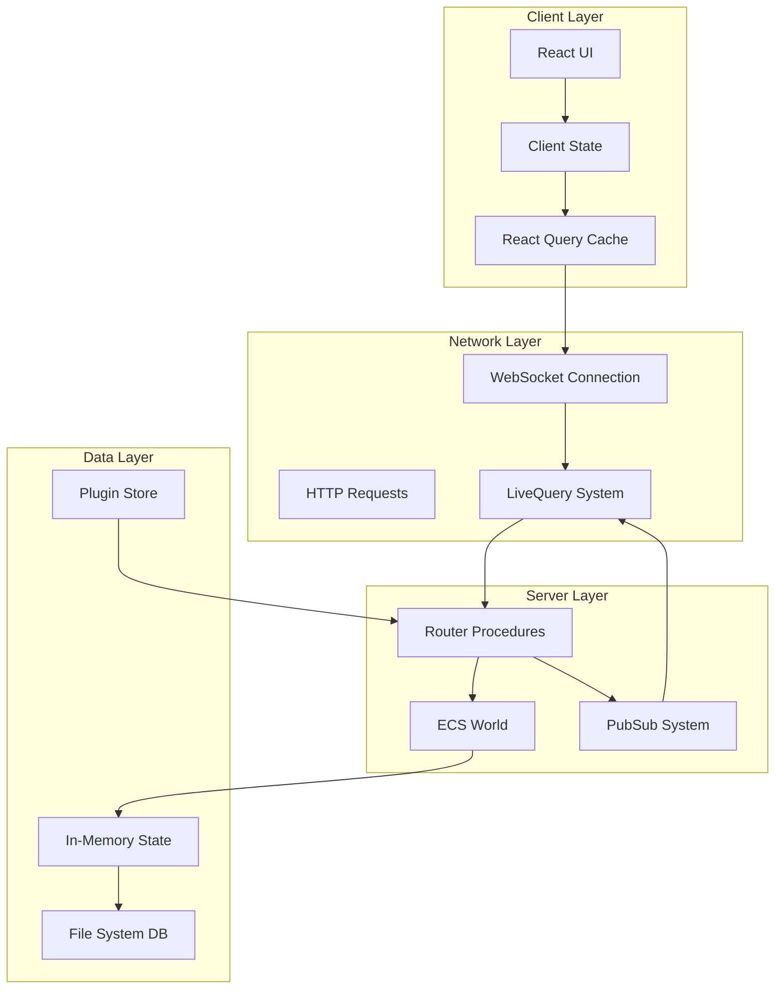
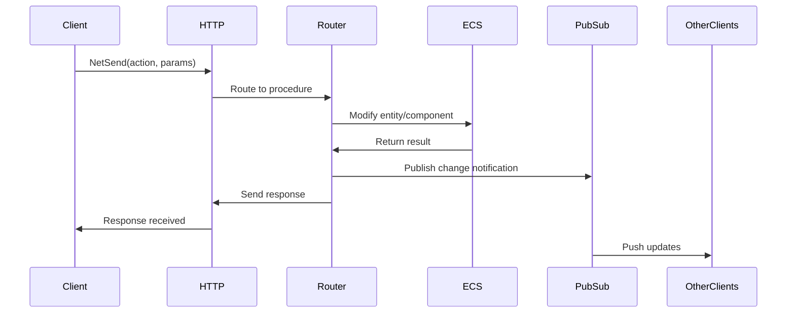
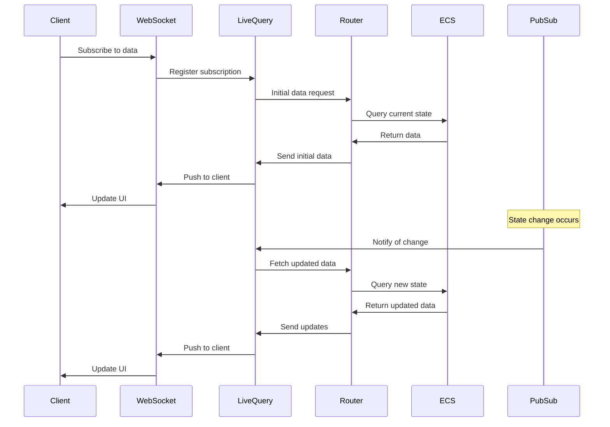
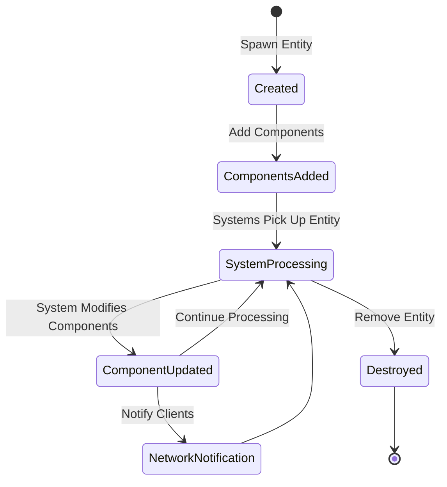
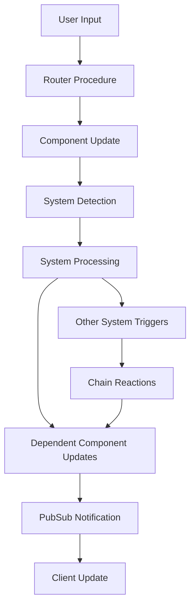
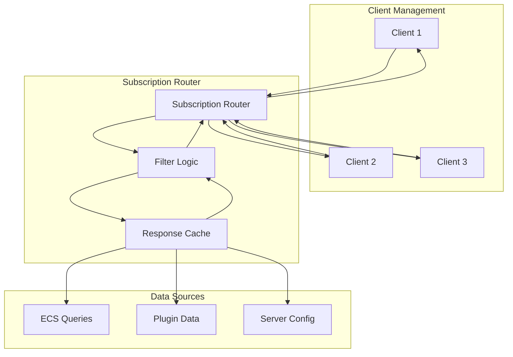
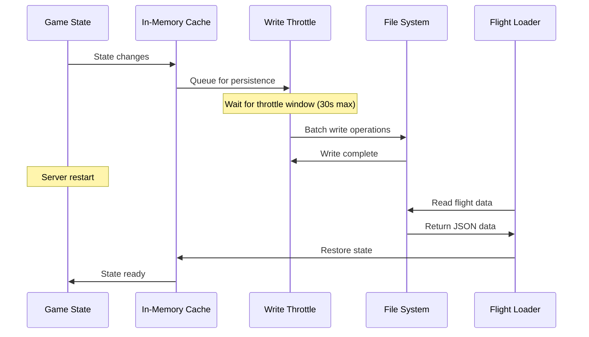
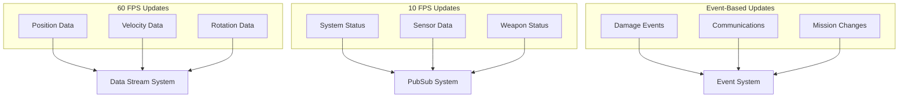
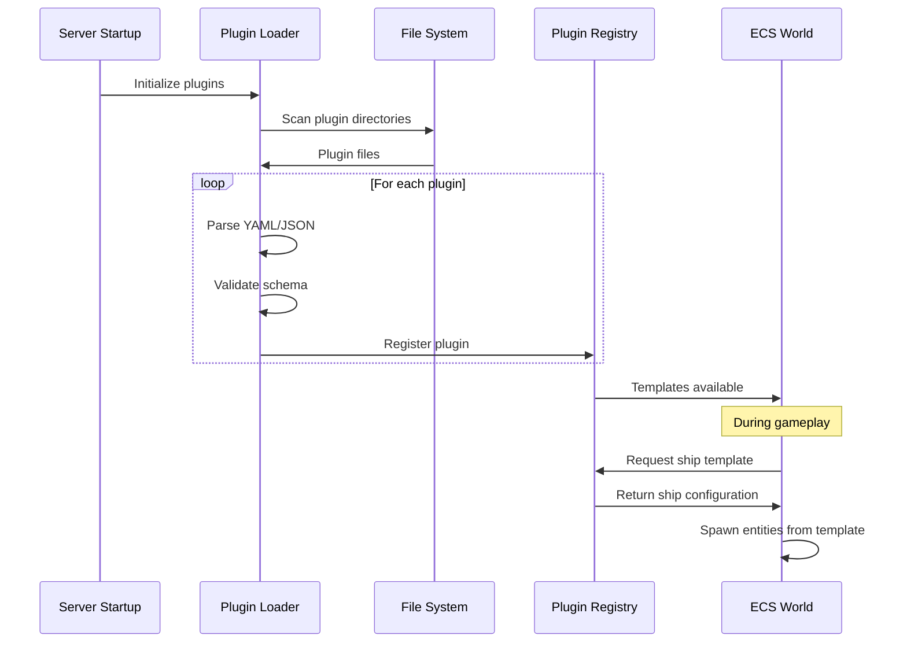

# Data Flow Documentation

## Table of Contents
1. [Overview](#overview)
2. [Client-Server Data Flow](#client-server-data-flow)
3. [ECS Data Pipeline](#ecs-data-pipeline)
4. [Network Layer Data Flow](#network-layer-data-flow)
5. [Persistence Layer](#persistence-layer)
6. [Real-time Updates](#real-time-updates)
7. [Plugin Data Integration](#plugin-data-integration)
8. [Performance Optimizations](#performance-optimizations)

## Overview

Thorium Nova's data flow is designed for real-time multiplayer gaming with multiple clients controlling different aspects of a spaceship. The system handles:

- **High-frequency updates** (position, velocity, sensor data)
- **Low-frequency updates** (ship configuration, mission status)
- **User commands** (button presses, control inputs)
- **Game state persistence** (save/load functionality)



## Client-Server Data Flow

### Request-Response Pattern (NetSend)



### Subscription Pattern (NetRequest)



### Data Types and Flow Patterns

#### Command Data Flow
User interactions that modify game state:

```typescript
// 1. User clicks "Fire Phasers" button
const firePhasers = () => {
  q.weapons.phasers.fire.netSend({
    shipId: currentShip.id,
    targetId: selectedTarget.id
  });
};

// 2. Router procedure processes command
export const phasersFire = t.procedure
  .input(z.object({ shipId: z.number(), targetId: z.number() }))
  .send(({ ctx, input }) => {
    const ship = ctx.flight.ecs.getEntityById(input.shipId);
    ship.updateComponent("targeting", { targetId: input.targetId });
    
    // Trigger ECS system to fire
    pubsub.publish.weapons.fire({ shipId: input.shipId });
  });

// 3. ECS system processes the firing
class PhasersSystem extends System {
  update(entity: Entity) {
    if (entity.components.targeting?.targetId) {
      this.firePhasers(entity);
      // Updates component state, triggers notifications
    }
  }
}
```

#### Query Data Flow
Real-time data subscriptions:

```typescript
// 1. Component subscribes to phaser data
const [phasers] = q.weapons.phasers.get.useNetRequest({ shipId });

// 2. LiveQuery manages the subscription
const subscription = {
  procedure: "weapons.phasers.get",
  params: { shipId: 123 },
  filter: (publish, input) => publish.shipId === input.shipId
};

// 3. Data changes trigger updates
pubsub.publish.weapons.phasers.get({ shipId: 123 });
// → LiveQuery fetches new data → Client receives update → UI re-renders
```

## ECS Data Pipeline

### Entity Lifecycle



### Component Update Cascade



### Example: Ship Movement Data Flow

```typescript
// 1. Player sets engine speed
q.pilot.impulseEngines.setSpeed.netSend({ shipId: 123, speed: 0.5 });

// 2. Router updates engine component
const engine = getShipSystem(ctx.ecs, { shipId: 123, systemType: "impulseEngines" });
engine.updateComponent("isImpulseEngines", { targetSpeed: 0.5 });

// 3. ImpulseSystem calculates velocity
class ImpulseSystem extends System {
  update(entity: Entity) {
    const engine = entity.components.isImpulseEngines;
    const ship = this.getShipEntity(entity);
    
    // Calculate new velocity based on engine speed
    const newVelocity = calculateVelocity(engine.targetSpeed, ship.components.rotation);
    ship.updateComponent("velocity", newVelocity);
  }
}

// 4. PhysicsMovementSystem updates position
class PhysicsMovementSystem extends System {
  update(entity: Entity) {
    const { position, velocity } = entity.components;
    position.x += velocity.x * deltaTime;
    position.y += velocity.y * deltaTime;
    position.z += velocity.z * deltaTime;
  }
}

// 5. DataStreamSystem broadcasts to clients
class DataStreamSystem extends System {
  update(entity: Entity) {
    if (entity.components.position) {
      this.sendPositionUpdate(entity);
    }
  }
}
```

## Network Layer Data Flow

### LiveQuery Subscription Management



### Message Types and Routing

#### High-Frequency Data Streams
```typescript
// Position updates (60 FPS)
interface PositionStream {
  type: "dataStream";
  topic: "position";
  entityId: number;
  data: {
    x: number;
    y: number;
    z: number;
    timestamp: number;
  };
}

// Sent via WebSocket with compression
webSocket.send(compressMessage(positionUpdate));
```

#### Low-Frequency Subscriptions
```typescript
// System status updates (on change)
interface SystemStatusUpdate {
  type: "subscription";
  requestId: string;
  data: {
    systemId: number;
    power: number;
    heat: number;
    status: "online" | "offline" | "damaged";
  };
}

// Sent via WebSocket when status changes
pubsub.publish.systems.status({ shipId, systemId });
```

#### Command Messages
```typescript
// User commands (as needed)
interface CommandMessage {
  type: "netSend";
  procedure: string;
  params: Record<string, any>;
  requestId: string;
}

// Sent via HTTP POST for reliability
fetch("/api/router", {
  method: "POST",
  body: JSON.stringify(commandMessage)
});
```

### Data Compression and Optimization

#### Delta Compression for Position Data
```typescript
class PositionDeltaCompressor {
  private lastPositions = new Map<number, Position>();
  
  compress(entityId: number, position: Position): CompressedPosition | null {
    const lastPos = this.lastPositions.get(entityId);
    if (!lastPos) {
      this.lastPositions.set(entityId, position);
      return { entityId, ...position, type: "full" };
    }
    
    const delta = {
      dx: position.x - lastPos.x,
      dy: position.y - lastPos.y,
      dz: position.z - lastPos.z
    };
    
    // Only send if change is significant
    if (Math.abs(delta.dx) > 0.1 || Math.abs(delta.dy) > 0.1 || Math.abs(delta.dz) > 0.1) {
      this.lastPositions.set(entityId, position);
      return { entityId, ...delta, type: "delta" };
    }
    
    return null; // No significant change
  }
}
```

#### Subscription Filtering
```typescript
// Filter ensures clients only get relevant data
const subscriptionFilter = (publishData: any, clientInput: any, clientContext: DataContext) => {
  // Only send ship data to clients assigned to that ship
  if (publishData.shipId !== clientContext.ship?.id) {
    return false;
  }
  
  // Only send weapon data to clients with weapons access
  if (publishData.type === "weapons" && !clientContext.station?.hasWeaponsAccess) {
    return false;
  }
  
  return true;
};
```

## Persistence Layer

### Save/Load Data Flow



### Data Serialization Format

#### Entity Serialization
```typescript
// In-memory entity structure
const entity = {
  id: 12345,
  components: {
    identity: { name: "USS Enterprise" },
    position: { x: 1000, y: 0, z: 500 },
    isShip: { registry: "NCC-1701" }
  }
};

// Serialized to file
{
  "entities": {
    "12345": {
      "identity": { "name": "USS Enterprise" },
      "position": { "x": 1000, "y": 0, "z": 500 },
      "isShip": { "registry": "NCC-1701" }
    }
  },
  "metadata": {
    "version": "1.0.0",
    "timestamp": "2024-01-01T00:00:00Z",
    "flightId": "flight_123"
  }
}
```

#### Flight State Persistence
```typescript
class FlightPersistence {
  private pendingWrites = new Set<string>();
  private writeThrottle = new Map<string, NodeJS.Timeout>();
  
  scheduleWrite(flightId: string, data: any) {
    // Cancel previous write timer
    if (this.writeThrottle.has(flightId)) {
      clearTimeout(this.writeThrottle.get(flightId)!);
    }
    
    // Schedule new write (max 30 seconds)
    const timer = setTimeout(() => {
      this.writeFlightData(flightId, data);
      this.writeThrottle.delete(flightId);
    }, 30000);
    
    this.writeThrottle.set(flightId, timer);
  }
  
  private async writeFlightData(flightId: string, data: any) {
    const filePath = path.join(dataPath, "flights", flightId, "flight.json");
    await fs.writeFile(filePath, JSON.stringify(data, null, 2));
  }
}
```

## Real-time Updates

### Update Frequency Tiers



### Client-Side Update Handling

```typescript
// High-frequency position updates
useDataStream("position", { shipId }, (data: PositionData[]) => {
  // Interpolate between updates for smooth movement
  data.forEach(update => {
    interpolationEngine.addPositionUpdate(update.entityId, update);
  });
});

// Low-frequency system updates
const [systems] = q.engineering.systems.useNetRequest({ shipId });
// Automatically re-renders when systems change

// Event-based updates
useEffect(() => {
  const unsubscribe = q.events.damage.subscribe(({ entityId, damage }) => {
    showDamageEffect(entityId, damage);
  });
  return unsubscribe;
}, []);
```

### Conflict Resolution

```typescript
// Handle conflicting updates from multiple sources
class ConflictResolver {
  resolvePositionConflict(
    serverPosition: Position,
    clientPosition: Position,
    timestamp: number
  ): Position {
    const timeDiff = Date.now() - timestamp;
    
    // If server update is recent, trust it
    if (timeDiff < 100) {
      return serverPosition;
    }
    
    // Otherwise, interpolate between positions
    return this.interpolatePositions(serverPosition, clientPosition, timeDiff);
  }
  
  private interpolatePositions(pos1: Position, pos2: Position, factor: number): Position {
    const alpha = Math.min(factor / 1000, 1); // Smooth over 1 second
    return {
      x: pos1.x + (pos2.x - pos1.x) * alpha,
      y: pos1.y + (pos2.y - pos1.y) * alpha,
      z: pos1.z + (pos2.z - pos1.z) * alpha
    };
  }
}
```

## Plugin Data Integration

### Plugin Loading Data Flow



### Plugin Data Merging

```typescript
// Plugin data merging strategy
class PluginMerger {
  mergeShipTemplates(baseShip: ShipTemplate, ...overrides: Partial<ShipTemplate>[]): ShipTemplate {
    return overrides.reduce((merged, override) => {
      return {
        ...merged,
        metadata: { ...merged.metadata, ...override.metadata },
        spec: {
          ...merged.spec,
          ...override.spec,
          systems: this.mergeSystems(merged.spec.systems, override.spec?.systems || [])
        }
      };
    }, baseShip);
  }
  
  private mergeSystems(base: SystemSpec[], override: SystemSpec[]): SystemSpec[] {
    const merged = [...base];
    
    override.forEach(overrideSystem => {
      const existingIndex = merged.findIndex(s => s.type === overrideSystem.type);
      if (existingIndex >= 0) {
        merged[existingIndex] = { ...merged[existingIndex], ...overrideSystem };
      } else {
        merged.push(overrideSystem);
      }
    });
    
    return merged;
  }
}
```

## Performance Optimizations

### Caching Strategies

#### Component Cache
```typescript
// ECS maintains component caches for fast queries
class ECS {
  private componentCache = new Map<string, Set<Entity>>();
  
  getEntitiesWithComponent(componentType: string): Entity[] {
    const cached = this.componentCache.get(componentType);
    if (cached) {
      return Array.from(cached);
    }
    
    // Rebuild cache if missing
    const entities = this.entities.filter(e => e.components[componentType]);
    this.componentCache.set(componentType, new Set(entities));
    return entities;
  }
  
  invalidateComponentCache(componentType: string) {
    this.componentCache.delete(componentType);
  }
}
```

#### Network Response Cache
```typescript
// Cache network responses to avoid redundant database queries
class ResponseCache {
  private cache = new Map<string, { data: any; timestamp: number }>();
  private TTL = 5000; // 5 second cache
  
  get(key: string): any | null {
    const cached = this.cache.get(key);
    if (cached && Date.now() - cached.timestamp < this.TTL) {
      return cached.data;
    }
    return null;
  }
  
  set(key: string, data: any) {
    this.cache.set(key, { data, timestamp: Date.now() });
  }
  
  invalidate(pattern: string) {
    for (const key of this.cache.keys()) {
      if (key.includes(pattern)) {
        this.cache.delete(key);
      }
    }
  }
}
```

### Batch Processing

```typescript
// Batch multiple updates to reduce network overhead
class UpdateBatcher {
  private batches = new Map<string, any[]>();
  private timers = new Map<string, NodeJS.Timeout>();
  
  addUpdate(topic: string, update: any) {
    if (!this.batches.has(topic)) {
      this.batches.set(topic, []);
    }
    
    this.batches.get(topic)!.push(update);
    
    // Schedule batch send if not already scheduled
    if (!this.timers.has(topic)) {
      const timer = setTimeout(() => {
        this.sendBatch(topic);
        this.timers.delete(topic);
      }, 16); // ~60 FPS
      
      this.timers.set(topic, timer);
    }
  }
  
  private sendBatch(topic: string) {
    const batch = this.batches.get(topic);
    if (batch && batch.length > 0) {
      pubsub.publish[topic](batch);
      this.batches.set(topic, []);
    }
  }
}
```

This comprehensive data flow documentation provides developers with a clear understanding of how data moves through Thorium Nova, enabling them to build features that integrate efficiently with the existing system.